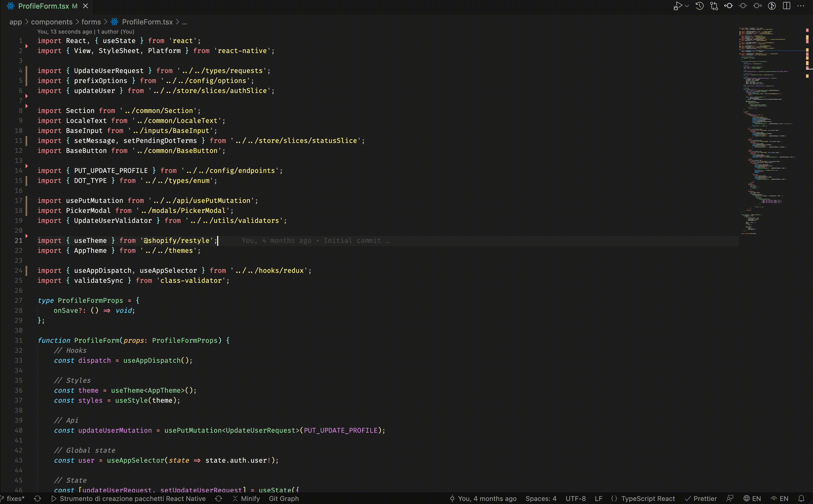

# JS Import Organizer

## Features

The import organizer extension will help you organize your file imports inside a js / ts project.
This extension does not use the built-in vs-code organizer but it relies only on a configuration file allowing a more granular control over the result.

> Note: Currently tested only on react and react-native. With the right config should be usable in any project

## Extension Settings

The extensions requires a configuration file inside the root of your project called `sorterconfig.json`

### Config file

| Parameter            | Type       | Description                                                                                |
| :------------------- | :--------- | :----------------------------------------------------------------------------------------- |
| `root`               | `string`   | **Required**. Path for the source folder. Files that are not included here will be ignored |
| `organizeOnSave`     | `string`   | Organize import on document save. Defaults to false                                        |
| `allowedExtensions?` | `string[]` | Allowed extensions                                                                         |
| `blocks`             | `Block[]`  | **Required** Specifies the groups                                                          |

### Block

| Parameter    | Type       | Description                                                                                                                            |
| :----------- | :--------- | :------------------------------------------------------------------------------------------------------------------------------------- |
| `name`       | `string`   | **Required**. Name of the block. Will be inserted as a comment before any import block                                                 |
| `libraries?` | `string[]` | Any imports related to one of the specified libraries will be added to the block                                                       |
| `folders?`   | `string[]` | Folder or file path relative to the specified root inside the config. Any import from a subdir of this path will be added to the block |

## Known Issues

The extension is currently in alpha, please report any bug

## Release Notes

For more info visit CHANGELOG.md
